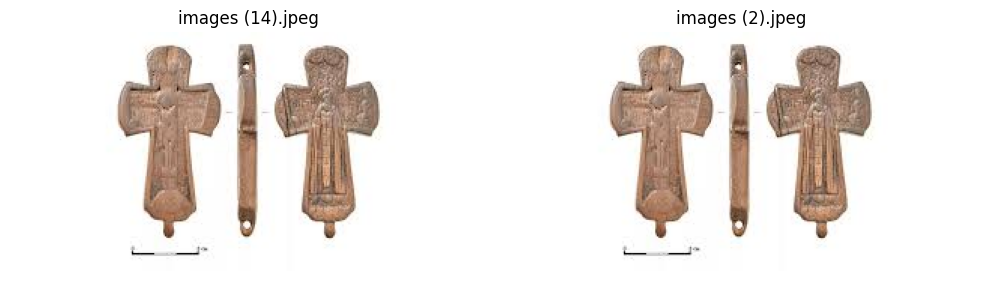
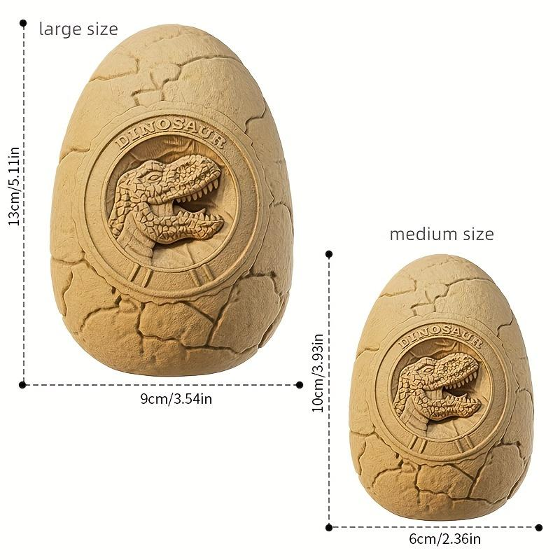
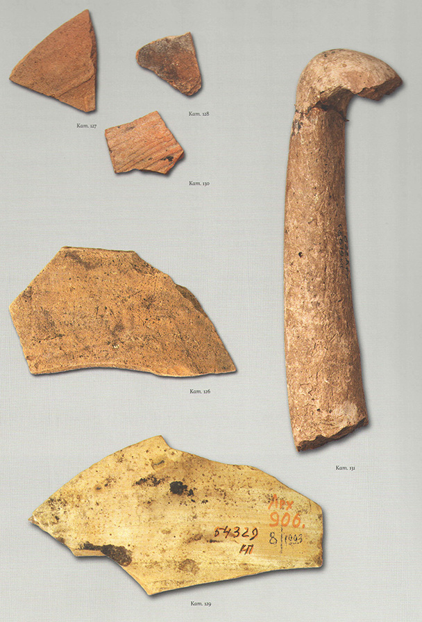
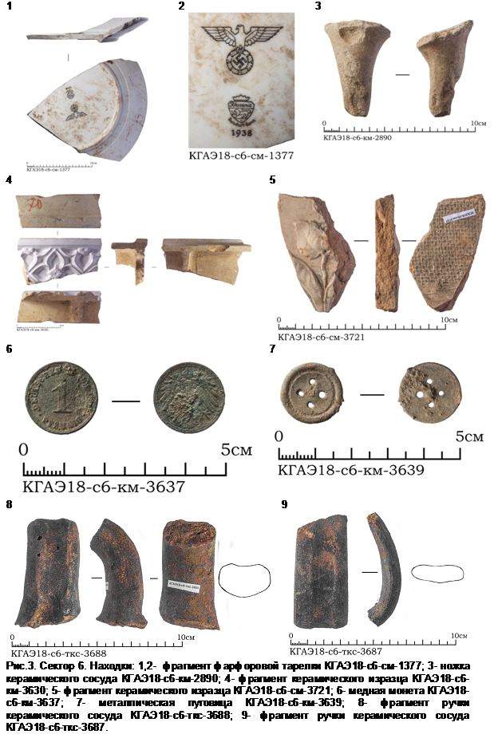
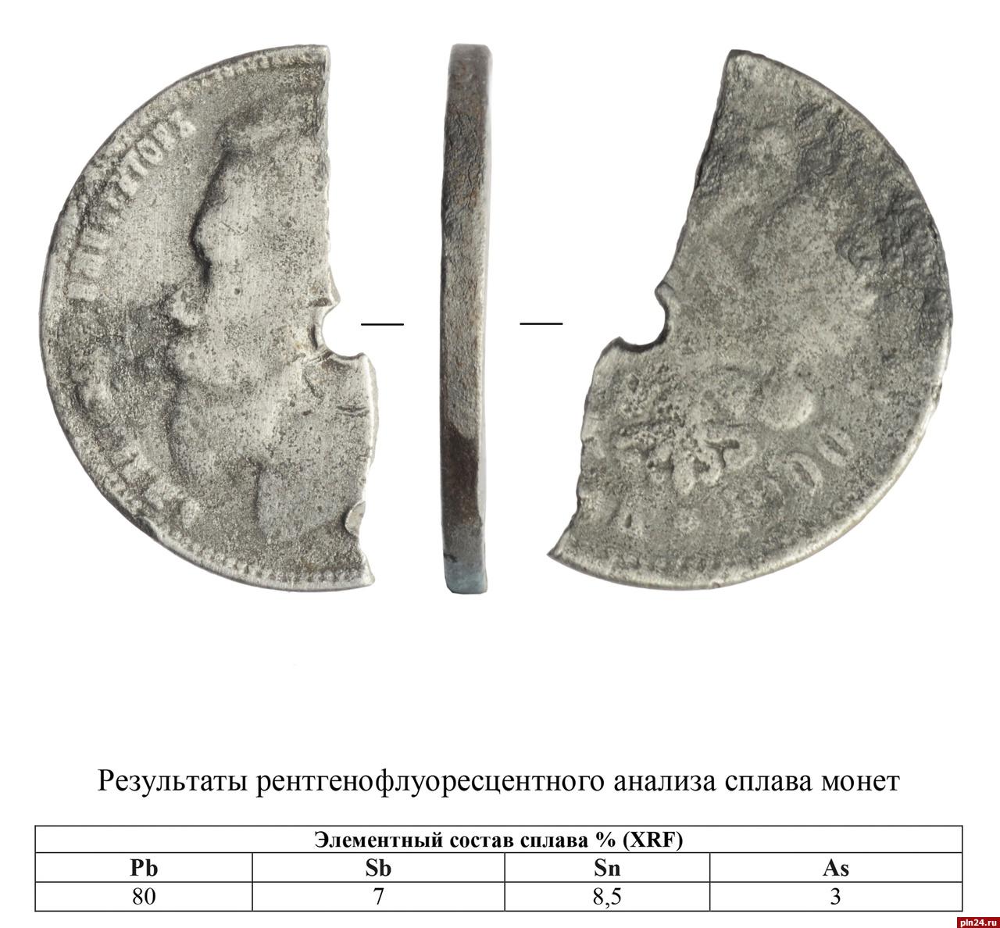
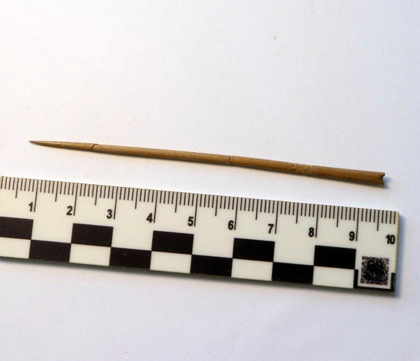
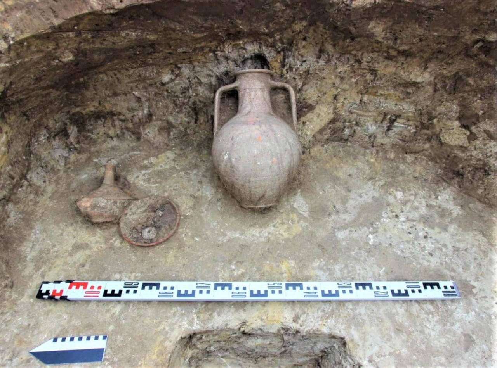
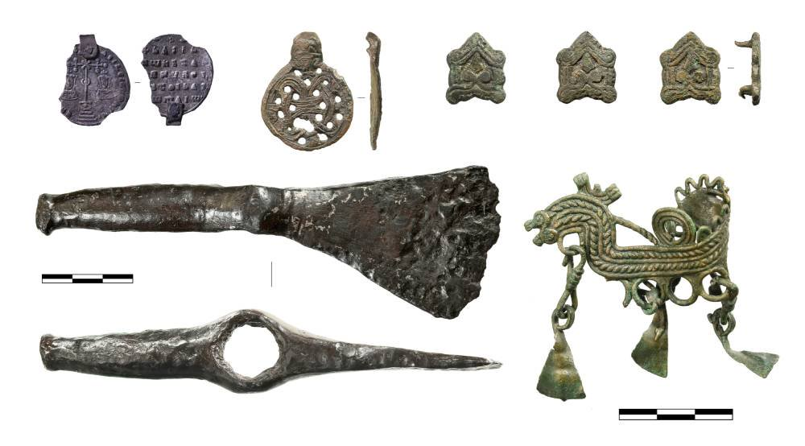
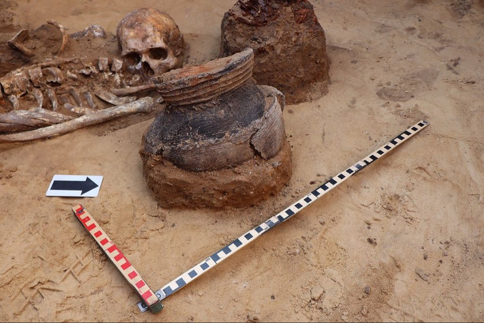

# Детектор линеек разных типов


Для чистоты, воспроизводимости и масштабируемости кода я решила использовать шаблон [**PyTorch Project Template**](https://github.com/Blinorot/pytorch_project_template).

#### Особенности шаблона
- **Конфигурация через Hydra** - все параметры обучения, пути и гиперпараметры задаются в YAML-файлах и легко изменяются через командную строку.
- **Отслеживание экспериментов** - интеграция с [Weights & Biases (WandB)](https://wandb.ai) для логирования и сравнения запусков.
- **Поддержка чистоты кода** - подключены инструменты `black`, `isort` и `flake8` через [pre-commit](https://pre-commit.com), которые автоматически форматируют код и проверяют его стиль.
- **Воспроизводимость** - каждый запуск сохраняется в отдельную папку `outputs/YYYY-MM-DD/`, что упрощает версионирование и анализ результатов.
- **Модульная структура** - код модели, датасета и тренера полностью разделён и легко расширяется под разные эксперименты.

#### Структура проекта

```bash
ruler_detector/
├── README.md
├── CITATION.cff
├── LICENSE
├── requirements.txt
├── requirements_eda_annotate.txt
├── train.py
├── inference.py
├── annotate.py
├── prepare_coco_splits.py
├── data/
│   └── ruler/
│       ├── annotations/
│       └── unlabeled/
├── notebooks/
│   └── eda_and_annotate.ipynb
├── outputs/                # Логи/артефакты запусков и визуализации
├── saved/                  # Сохранённые эксперименты и конфиги
├── weights/                # Предобученные веса (CLIP, DINO, YOLO и т.п.)
├── img/                    # Примерные изображения/визуализации
└── src/
    ├── configs/           # Hydra-конфиги: датасеты, модели, тренинг, инференс
    ├── datasets/          # Загрузчики данных и утилиты
    ├── logger/            # Логирование и настройка логов
    ├── loss/              # Функции потерь
    ├── metrics/           # Метрики (mAP и др.)
    ├── model/             # Определения моделей
    ├── pipelines/         # Пайплайны (если используются)
    ├── trainer/           # Тренер, инференсер и базовые классы
    ├── transforms/        # Аугментации и преобразования (albumentations и т.д.)
    └── utils/             # Вспомогательные функции
```

## Данные

Датасет не размечен, состоит из 75 изображений с линейками: физическими и цифровыми, с различными делениями, подписями и без. На 11 изображениях нет линеек, на остальных находится от 1 до 8 штук.

Дополнительный автоматический анализ можно посмотреть в [ноутбуке](notebooks/eda_and_annotate.ipynb).

Выявлены следующие аномалии и проблемы в данных:
* дубликаты

* шкалы, которые не являются линейками, но возможно мы хотим извлечь из них информацию о размерах предмета
  
или просто цифры, которые в потенциале могут быть размерами.
 
Тут зависит от конечной задачи, пока просто работаем с детекцией линеек, а их на этих изображениях нет.
* черные полосы, я решила их считать за линейки тоже (но лучше еще уточнить у профильного специалиста)

* разный масштаб линеек
 
* таблица, которую можно спутать с линейкой (хорошо, что такой пример есть в датасете, можно добавить похожие)

Есть пример "таблицы" - линейки (хотя тут тоже бы проконсультироваться на всякий случай)

* плохое качество некоторых изображений

* сложные случаи, когда может выделиться несколько линеек. Если хотим различать разные виды линеек для последующей обработки делений, то может их стоит размечать разными классами

* физические линейки расположены под разными углами, они из разного материала (пластиковые, деревянные, есть металлические рулетки) и могут быть специфической формы, например, с треугольным концом

* есть непонятные тонкие полосы, могут быть определены детекторами как линейки
  
* количество линеек не всегда очевидно, в данном случае разметила, как 2 разные
  
* подписи могут относиться не к линекам, а быть, например, нумерацией предметов, размечать решила без цифр.

Выводы по данным и варианты решения проблем:
* датасет маленький, надо дополнять еще данными или хотя бы делать аугментации
* разделение на train/val/test лучше делать стратифицированно, чтобы выборки содержали примеры всех типов линеек и пустых изображений, но для этого надо выделять отдельные классы линеек, пока так делать не буду
* по визуальному балансу: физические и цифровые линейки представлены примерно в равных количествах, однако присутствуют редкие экземпляры (например, нестандартные формы или шкалы). При этом цифровые линейки выглядят более однотипно, тогда как физические значительно варьируются по материалу, форме и углу съёмки - это может повлиять на устойчивость модели

## Подготовка и аннотация датасета

Есть несколько способов ускорения аннотации изображений:
1. Auto-labeling с хорошими моделями. Можно сделать ансамбль и объединять выданные боксы (или какой-то другой пост-процессинг).
2. Active learning loop. Можно обучить модель (например, YOLO или DINO) на 10-20 размеченных изображениях, а дальше запускать разметку на остальных.
3. Template matching для однотипных линеек. Искать аналогичные участки через feature matching (ORB/SIFT) или cross-correlation, но по моему опыту - работает такое плохо, особенно если на другом изображение есть какой-то шум или линейка под углом.

Я решила попробовать первый вариант с Grounding Dino, для разметки использовалось несколько промптов: ruler, measuring tape, tape measure, digital ruler, folding ruler, carpenter's ruler (указаны в [конфиге](src/configs/annotate.yaml)).

Авторазметка получилась неочень:


Так как датасет маленький, то решила, что целесообразнее размечать вручную, а не тестировать еще модели для прелейблинга и подбирать под них параметры. Одно изображение-дубликат удалила, так как новой информации оно не несет. Изображения без линеек оставила, чтобы модель могла еще выучить фон.

Я не была уверена, что можно делать датасет публичным, поэтому вместо Roboflow использовала LabelStudio.

На текущем этапе я пока не стала расширять датасет, однако нашла [первого кандидата](https://universe.roboflow.com/practicas-6jgbv/ruler-zgouh/browse?queryText=&pageSize=50&startingIndex=0&browseQuery=true) для его дополнения. В то же время [этот кандидат](https://universe.roboflow.com/rulerdataset/ruler-detection-velko/browse?queryText=&pageSize=50&startingIndex=0&browseQuery=true) может негативно повлиять на качество детекций, поскольку содержит изображения с рыбой - модель начнёт запоминать этот контекст. Дополнительно расширить датасет можно с помощью синтетических изображений и аугментаций.

Примеры получившейся разметки продемонстрированы в том же ноутбуке, где и eda, готовый датасет можно скачать по [ссылке](https://disk.yandex.ru/d/cDTalYHzifwbCA).

## Эксперименты

### Для запуска кода нужно:

1. Положить картинки в папку /data/ruler/unlabeled.
2. Создать и активировать виртуальное окружение:
   ```bash
   python3 -m venv .venv
   source .venv/bin/activate
   pip install --upgrade pip
   ```
3. Установить зависимости.
* Для eda и аннотирования:
   ```bash
   pip install -r requirements_eda_annotate.txt
   ```
   И Grounding DINO отдельно, так как пакет не публикуется на PyPI и его скрипт сборки ломает зависимости.
   ```bash
   pip install --no-build-isolation --no-deps "groundingdino @ git+https://github.com/IDEA-Research/GroundingDINO.git"
   ```
* для обучения и инференса
```bash
   pip install -r requirements.txt
   ```
4. Если планируете логирование, авторизуйтесь в Weights & Biases (нужен VPN):
   ```bash
   wandb login
   ```
2. Для аннотирования скачайте веса моделей и положите их в папку `weights/`:
   ```bash
   mkdir -p weights
   wget https://raw.githubusercontent.com/IDEA-Research/GroundingDINO/main/groundingdino/config/GroundingDINO_SwinT_OGC.py -O weights/GroundingDINO_SwinT_OGC.py
   ```

#### Обучение и инференс через train.py / inference.py

Запустить обучение модели детекции линеек:
   ```bash
   python train.py --config-name=train_faster_rcnn
   ```
<!-- python train.py --config-name=train_faster_rcnn trainer.override=True -->

   Чекпоинты и логи появятся в `saved/ruler-detector`. Пороговые фильтры можно менять в `src/configs/ruler_train.yaml`.

Для инференса используйте сохранённый чекпоинт:
   ```bash
   python inference.py --config-name=inference_faster_rcnn inferencer.from_pretrained="saved/faster_rcnn1/model_best.pth"
   ```
   Предсказания сохраняются в `data/saved/ruler_inference/test/prediction_*.pth`.

### Бейзлайн

Для бейзлайна выбрала одну из класссических моделей детекции Faster R-CNN на ResNet50‑FPN, взяла готовую архитектуру из torchvision.

**Гиперпараметры, лосс, метрики**

Сначала я запускала со следующими параметрами: 25 эпох, AdamW с небольшим lr=5e-5 при батче 2 и без аугментаций, но модель особо не обучилось, сходимость была слабой.

Во втором эксперименте оптимайзер заменила на SGD для большей устойчивости, для избегания резких скачков lr взяла lr_scheduler CosineAnnealingLR, lr=0.001. Чтобы модель успела сойтись на нашем маленьком датасете, увеличила количество эпох до 80, добавила early stop после 10 эпох без улучшений и аугментации: поворот, отражение и др (полный список гиперпараметров можно увидеть в конфигах).

График лоссов:


Лосс - стандартный для Faster R-CNN: он просто суммирует loss_classifier, loss_box_reg, loss_objectness, loss_rpn_box_reg.

Метрика - COCO mAP из torchmetrics, потому что она учитывает несколько IoU и показывает, совпадают ли детекции с разметкой.


Лосс на валидационной выборке уменьшается, на трейне скачет, возможно, из-за аугментаций, метрика повышается, так что обучается хорошо.

Детекция на примере из val выборки:


**Выбор чекпоинта**
Тренер отслеживает val_mAP и сохраняет лучший вес как model_best.pth. Критерий — максимум mAP на валидации.

**Качество решения**

Остановила обучение на 24 эпохе, так как уже поджимало время. Качество плохое, но лучше, чем в первом эксперименте.

test_mAP: 0.24

### Следующие шаги:
* конечно, лучше попробовать более сильные модели (например, можно взять что-то по [бенчмаркам](https://blog.roboflow.com/best-object-detection-models/)), просто по заданию нужно было использовать pytorch, а YOLO и другие ultralitics модели - это обращение к black-box, хотя конечно можно взять их код и проводить эксперименты с архитектурой
* расширение датасета

Если рассматривать более сложную задачу измерения размера объектов, то тут после детекции будут еще:

1. коррекция перспективы
2. нахождения соотношения пикселей и миллиметров
3. измерение объекта (перевод пикселей в миллиметры)

## Рефлексия или что можно было сделать лучше

1. Мне хотелось сделать хорошую структуру кода, но в итоге я на нее потратила много времени, так как раньше не работала с таким шаблоном, в итоге на эксперименты ничего не осталось. Тут всегда баланс между поддерживаемостью и быстротой разработки.
2. Для улучшения воспроизводимости можно было запускать все в докере с фиксированным окружением, но в данном случае, достаточно того, что есть, сиды зафиксированы, версии библиотек тоже.
3. Roboflow все-таки удобнее Label Studio.
